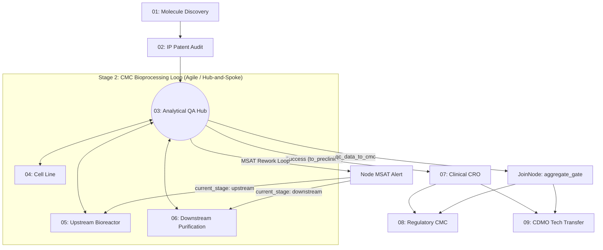

# Biopharma Capstone: Multi-Workstream Process Framework

Welcome to the **Enterprise BioPharma Portfolio Gateway**. This repository hosts a modular, multi-agent ecosystem designed to orchestrate the lifecycle of Antibody-Drug Conjugate (ADC) development for lung oncology targets (such as HER2 and TROP2). 

This document details the multi-workstream process vision, 4-quadrant directory structure, implemented platform primitives, and reproducible command-line environment setup instructions.

---

## 1. Multi-Workstream Process Vision

Our orchestration engine balances the rapid iteration of wet-lab research with the rigid compliance of clinical trial regulatory gates by dividing lifecycle nodes into distinct PM paradigms:



### 🔬 Agile Molecule Engineering Workstream
* **Scope:** Node 01 (Discovery), Node 03 (Analytical Quality Hub), and Node 05 (Upstream Bioreactor).
* **Execution Style:** Iterative sprint cycles, fast feedback loops, and continuous data refinement.
* **Control Hub:** **Node 03 (Analytical Quality Hub)** acts as the central gatekeeper, verifying product quality criteria dynamically.

### 📋 Predictive/Waterfall Clinical & CDMO Workstream
* **Scope:** Node 02 (IP Patent), Node 04 (Cell Line), Node 06 (Downstream Purification), Node 07 (Clinical CRO), Node 08 (Regulatory CMC), and Node 09 (CDMO Tech Transfer).
* **Execution Style:** Linear phase-gate execution, rigid milestone approvals, and sequential dependencies.
* **Control Hub:** Rigid sign-offs and join-gates (e.g. `aggregate_gate`) aggregate files before graduating packages to downstream CDMO transfers.

### 🔀 Three-Tier Operational Classification Views
To manage compute footprint, we classify our lifecycle nodes into three operational views:
* **Predictive Streams (Deep ML-Driven):** Node 02 (IP Patent), Node 04 (Cell Line), Node 08 (Regulatory CMC), Node 09 (CDMO Tech Transfer).
* **Agile Streams (Iterative Wet-Lab):** Node 01 (Discovery), Node 05 (Upstream Bioreactor), Node 06 (Downstream Purification).
* **Hybrid Streams (Milestone/Gate-Driven):** Node 03 (Analytical Quality Hub), Node 07 (Clinical CRO).

---

## 2. 4-Quadrant Directory Tree Structure

To enforce a strict separation of concerns, each specialized lifecycle node implements a uniform 4-quadrant directory structure. This ensures predictability and modularity across all agents:

```
[node_directory]/
├── assets/       # Declarative blueprints, Pydantic schemas, and target run guidelines
├── reference/    # Domain documentation, historical baselines, and golden batch records
├── scripts/      # Execution-level logic, python runners, and local validation code
└── resources/    # Supporting assets, local mock files, and testing dependencies
```

### Top-Level Workspace Organization
```
capstone-project/
├── .agent_state/           # Shared file bus for A2A handshakes and telemetry logs
├── .agents/                # Project-scoped agent skill configurations
├── biopharma-ip-watch/     # Competitive threat monitoring files
├── biopharma-radar/        # Horizon scanning dashboard and email alerts
├── capstone-router/        # FastAPI main routing gateway
├── enterprise_gateway/     # OAuth manifests and cryptographic key stores
├── skills/                 # Quadrant-compliant lifecycle nodes (00 through 09)
│   ├── 00_meta_governor/
│   ├── 01_molecule_discovery/
│   ├── 02_ip_legal_patent/
...
```

---

## 3. Implemented Course Primitives

Our system architecture enforces security, safety, and correctness via several deterministic design primitives:

### 🛡️ Kernel-Isolated Sandbox (gVisor)
All external code executions and automated simulation scripts are run inside a kernel-isolated sandbox utilizing Google's **gVisor** (`runsc`). Syscalls are filtered dynamically, terminating executing tasks immediately upon detecting unauthorized system calls (e.g. raw shell executions outside container bounds). Configured via `sandbox_rules.yaml` and run via `secure_runner.sh`.

### 🧠 Meta-Governor Autonomous Code-Graduation
An evaluation loop enforces strict graduation limits before code packages can be deployed to production:
* **Monomer Purity Baseline:** $\ge 98.0\%$
* **Monomer Aggregation Limit:** $\le 2.0\%$
* **Cell Viability Baseline:** $\ge 80.0\%$
* Enforced via `self_heal_validator.py` which adjusts parameters dynamically and re-compiles until convergence is achieved.

### 🛑 Human-in-the-Loop (HITL) Interceptor Gates
Critical operations freeze automatically, requiring human sign-off on the file bus. The six unbypassable gates are:
1. **OOS / Deviation Rework Re-entry:** Pauses loopback parameters to Node 05 to prevent infinite runs.
2. **Blocking FTO Patent Classification:** Freezes before classifying a competitor patent as blocking.
3. **Competitive Radar Alerts:** Pauses before emailing executives high-severity risk threat indicators.
4. **CMC Regulatory Join:** Pauses at `aggregate_gate/final_join` prior to compiling Module 3 IND dossier.
5. **Destructive Git/DB/File Mutations:** Stops any rollback or index cache clearing.
6. **Code Merges:** Freezes prior to graduating builds.

*To resume, a valid cryptographic token (set via the `ADK_OAUTH_TOKEN` environment variable — not stored in source) must be written to `.agent_state/hitl_pending_authorizations.json`.*

### 🔀 Event-Driven A2A Messaging
Instead of wasteful polling cycles, the Context Pruner (`event_handler.py`) monitors file state changes inside `.agent_state/` using standard filesystem watches, routing payloads to appropriate nodes within milliseconds of generation.

---

## 4. Reproducible Environment Setup (using `uv`)

To initialize and run this project locally, utilize the `uv` tool suite for lightning-fast, reproducible python environment configuration:

### Prerequisite: Install `uv`
If `uv` is not already installed on your system, install it using your system shell:
```powershell
# Windows PowerShell
powershell -c "irm https://astral.sh/uv/install.ps1 | iex"
```
```bash
# macOS/Linux
curl -LsSf https://astral.sh/uv/install.sh | sh
```

### Step 1: Initialize Virtual Environment
Initialize a virtual environment using the local python toolchain:
```bash
uv venv
```

### Step 2: Activate the Virtual Environment
Activate the environment to bind terminal commands:
```powershell
# PowerShell (Windows)
.venv\Scripts\Activate.ps1
```
```cmd
# Command Prompt (Windows)
.venv\Scripts\activate.bat
```
```bash
# Bash (Linux/macOS)
source .venv/bin/activate
```

### Step 3: Install Required Dependencies
Sync project dependencies:
```bash
uv pip install -r requirements.txt
```

### Step 4: Run Compliance Auditing
Validate that the repository compliance, security scanner, and skill nodes are 100% compliant:
```bash
python verify_skills.py
```

### Step 5: Run the Streamlit Dashboard
Launch the Biopharma Portfolio Dashboard interface:
```bash
streamlit run dashboard.py
```
