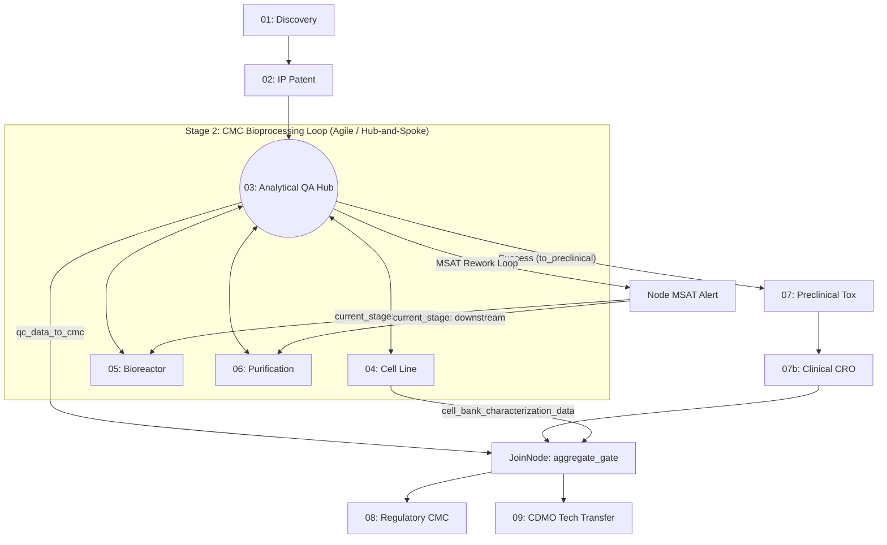
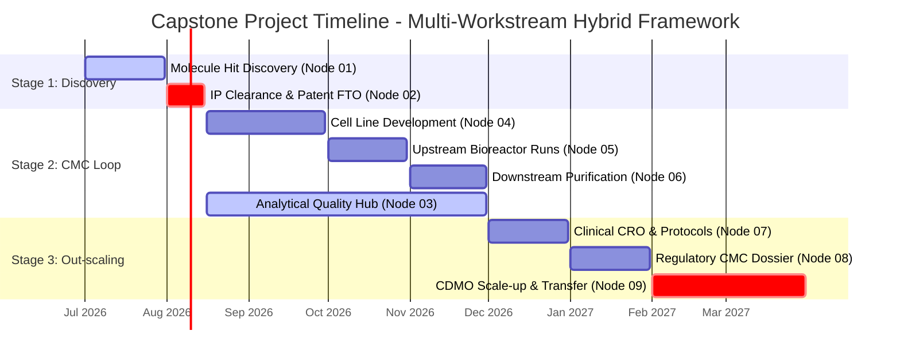

# Biopharma Capstone Master Router

This document serves as the core specifications sheet and routing engine description for the **Multi-Workstream Hybrid Framework**. It details the orchestration rules, data contracts, PM methodologies, and timelines governing our Capstone deployment.

---

## 1. Hybrid Project Management Governance

Our workflow integrates two distinct project management paradigms to match the speed of research with the precision of compliance:

### 🔬 Agile Molecule Engineering Workstream
* **Scope:** Nodes 01, 03, and 05 (Discovery, CQAs, Bioreactor).
* **Execution Style:** Iterative sprint cycles, fast feedback loops, and continuous data refinement.
* **Control Hub:** **Node 03 (Analytical Quality Hub)** acts as the quality gate, validating product criteria continuously.

### 📋 Predictive/Waterfall Clinical MCP Outsourcing Workstream
* **Scope:** Nodes 02, 04, 06, 07, 08, and 09 (IP Law, Cell Line, Purification, Clinical CRO, Regulatory CMC, CDMO Tech Transfer).
* **Execution Style:** Linear phase-gate execution, rigid milestone approvals, and sequential dependencies.
* **Milestone Gates:** Rigid sign-offs required at each node transition.

| Node | Name | Methodology | Primary Responsibility |
|---|---|---|---|
| **01** | [Molecule Discovery](skills/01_molecule_discovery/SKILL.md) | Agile | Target hit validation |
| **02** | [IP Legal & Patent](skills/02_ip_legal_patent/SKILL.md) | Waterfall | Freedom-To-Operate (FTO) review |
| **03** | [Analytical Quality Hub](skills/03_analytical_quality/SKILL.md) | Agile | Central CQA Validation & Gatekeeping |
| **04** | [Cell Line Development](skills/04_cell_line_development/SKILL.md) | Waterfall | Stable clone development (3-6 Months stable titer development running in parallel with Agile transient generation sprints) |
| **05** | [Upstream Bioreactor](skills/05_upstream_bioreactor/SKILL.md) | Agile | Cell expansion & harvest production (Time-boxed runs producing pilot material) |
| **06** | [Downstream Purification](skills/06_downstream_purification/SKILL.md) | Waterfall | Product isolation & clearing (Rigid purification streams with built-in risk contingency plans) |
| **07** | [Clinical Outsourcing](skills/07_clinical_outsourcing/SKILL.md) | Waterfall | Clinical trial protocols & MSA (24-36 Month timeline outsourced via MCP) |
| **08** | [Regulatory CMC](skills/08_regulatory_cmc/SKILL.md) | Waterfall | eCTD Module 3 compilation (Final zero-paraphrase dossier audit) |
| **09** | [CDMO Outsourcing](skills/09_cdmo_outsourcing/SKILL.md) | Waterfall | Commercial scale tech-transfer (Master Batch Records compilation) |

### 🔀 3-Operational Type Workstream Views
Our 9 lifecycle skill nodes are organized under three distinct operational views:

* **Predictive Streams (Deep ML-Driven)**:
  * Node 02: [IP Legal & Patent](skills/02_ip_legal_patent/SKILL.md)
  * Node 04: [Cell Line Development](skills/04_cell_line_development/SKILL.md)
  * Node 08: [Regulatory CMC](skills/08_regulatory_cmc/SKILL.md)
  * Node 09: [CDMO Outsourcing](skills/09_cdmo_outsourcing/SKILL.md)

* **Agile Streams (Iterative Wet-Lab Optimization)**:
  * Node 01: [Molecule Discovery](skills/01_molecule_discovery/SKILL.md)
  * Node 05: [Upstream Bioreactor](skills/05_upstream_bioreactor/SKILL.md)
  * Node 06: [Downstream Purification](skills/06_downstream_purification/SKILL.md)

* **Hybrid Streams (Milestone/Gate-Driven)**:
  * Node 03: [Analytical Quality Hub](skills/03_analytical_quality/SKILL.md)
  * Node 07: [Clinical Outsourcing](skills/07_clinical_outsourcing/SKILL.md)

---

## 2. Sequential Workflow & Routing Model

### Stage 1: Discovery & Legal Check (Linear/Sequential)
1. **Node 01 (Discovery)** screen hits. High affinity candidate files are output.
2. **Node 02 (IP/Patent)** runs prior art search and provisional patent filing. Candidates cannot pass to Stage 2 without approved FTO status.

### Stage 2: CMC Bioprocessing Loop (Hub-and-Spoke)
3. **Node 03 (Analytical Quality)** acts as the **central Hub**. It receives sample data and evaluates CQAs contextually:
   * **Node 04** sends clones; **Node 03** sends purity specs.
   * **Node 05** sends viable cell metrics; **Node 03** runs Hotelling's T² / SPE control schemas and feed optimizations. If breached, routes to Node MSAT.
   * **Node 06** sends chromatograph elutions; **Node 03** runs Purity >= 98.0% and HCP Clearance >= 4.0 LRV checks. If failed, routes to Node MSAT.
   * **Node MSAT** functions as a Root Cause Analysis (RCA) and disposition-assignment body, writing an audit payload to `.agent_state/deviation_disposition_ledger.json` before routing loopbacks dynamically back to either **Node 05** (upstream) or **Node 06** (downstream).

### Stage 3: Clinical & Commercial Out-scaling (Waterfall Phase-Gates)
5. Once Node 03 certifies the downstream product quality, the workstream simultaneously splits in parallel:
   * Downstream material edge is routed to **Node 07 (Preclinical Tox)** to feed GLP toxicology studies.
   * Orchestration state parameter edge (`qc_data_to_cmc` / `analytical_characterization_data`) is routed directly to **JoinNode: aggregate_gate** to supply the CMC regulatory compilation package.
6. **Node 08 (Regulatory CMC)** takes the clinical protocols and analytical quality data to compile the IND Module 3 Quality dossier.
7. **Node 09 (CDMO Tech Transfer)** runs [commercial_transfer.py](skills/09_cdmo_outsourcing/scripts/commercial_transfer.py) to finalize tech transfer, scaling up clinical production into commercial manufacturing.

---

## 3. Project Gantt Timeline

The chronological rollout of the framework is represented by the following Gantt chart, showing the transition from discovery sprints, bioprocess feedback loops, and clinical/CDMO waterfall milestones:

---

## 4. Sandbox Security & gVisor Execution Rules

To protect clinical pipeline data and secure code execution, we mandate kernel-isolated sandbox execution.
* **Sandbox Runtime:** gVisor (`runsc`) enforces strict OCI container restrictions on system calls.
* **Syscall Filter:** Only safe syscalls (like `read`, `write`, `openat`, etc.) are allowed. Execution is immediately terminated (`deny_action: KILL`) on unapproved syscalls.
* **Sandbox Configuration:** Managed via [sandbox_rules.yaml](sandbox_rules.yaml) and wrapped by the [secure_runner.sh](secure_runner.sh) launch wrapper.

---

## 5. RAG Pipeline Search Boundaries

We deploy a Retrieval-Augmented Generation (RAG) search indexing loop to retrieve news and regulatory updates.
* **Boundary:** Searches are capped to a strict **Top-5 RAG filter boundary** to prevent information overload for the Project Manager.
* **RAG Pipeline Engine:** Managed via [pipeline.py](pipeline.py), indexing scraped alerts from the Threat Radar and fetching relevant targets based on keyword vectors.

---

## 6. Meta-Governor Autonomous Code-Graduation Criteria

The final verification of pipeline validation is managed by the **Meta-Governor**, an autonomous evaluation loop verifying Kaggle SAE graduation rules.
* **Purity Threshold:** Monomer purity baseline must be $\ge 98.0\%$.
* **Aggregation Boundary:** Monomer aggregation must be $\le 2.0\%$.
* **Cell Viability Baseline:** Upstream cell viability must be $\ge 80.0\%$.
* **Isolation Verification:** Confirms gVisor OCI configuration files are active.
* **Autonomous Pipeline:** Implemented in [meta_governor/eval_pipeline.py](meta_governor/eval_pipeline.py).

---

## 7. Inner Loop Spec-Change Self-Healing

We enforce an automated self-healing compilation loop to resolve code out-of-spec incidents.
* **Flow:** The [self_heal_validator.py](self_heal_validator.py) engine monitors flat YAML parameters, programmatically re-generates and writes CQA evaluation metrics to [skills/03_analytical_quality/scripts/pat_monitoring.py](skills/03_analytical_quality/scripts/pat_monitoring.py), executes the run inside `secure_runner.sh`, and evaluates outputs.
* **Feedback Loop:** If baselines are missed, error-stacks are piped back into the compiler for parameter adjustment (purity +0.8%, aggregation -0.6%) until convergence.

---

## 8. Event-Driven Messaging Architecture

All A2A data handshakes are event-driven to minimize latency.
* **Polling Trigger:** The [event_handler.py](event_handler.py) engine polls the `.agent_state/` and `.agent_state/a2a_03_handshakes/` folders using standard file-system monitors.
* **Routing:** On detecting a new A2A contract JSON receipt, the handler reads source and destination nodes, parsing payloads and triggering corresponding skill agent execution within milliseconds of file generation.
* **Context Isolation & Bus Serialization:** Context-isolated execution agents (/skills/) must serialize their structural conclusions and token spending counts directly onto this disk bus (under `.agent_state/`) upon completing any DAG gate sequence. To eradicate context rot, active model context windows must be completely flushed between turns.

---

## 9. Cloud Run Production Deployment Targets

The Process 2.0 lifecycle control panel is containerized for scalable enterprise deployment.
* **Target Environment:** GCP Cloud Run.
* **Configuration:** Root-level [Dockerfile](Dockerfile) inherits from `python:3.14-slim`, packages dependencies via `requirements.txt`, exposes the standard port `8080`, and executes the Streamlit dashboard on startup.

---

## 10. 3-Tier Agent Classification Matrix

To optimize platform telemetry, monitor agent execution patterns, and trace compute costs, our 13-agent roster is classified into three operational tiers:

### 📋 Tier A (Routine & Operational)
These agents perform routine audit checks, handle filesystem state coordination, and execute linear waterfall validation tasks.
* **AgBOM Guardrail Agent** ([verify_skills.py](verify_skills.py)): Validates format compliance for all skills nodes.
* **Context Pruner Agent** ([event_handler.py](event_handler.py)): Coordinates file-polling routing and triggers.
* **Node 02 IP Legal Agent** ([SKILL.md](skills/02_ip_legal_patent/SKILL.md)): Freedom-to-operate patent screening.
* **Node 04 Cell Line Agent** ([SKILL.md](skills/04_cell_line_development/SKILL.md)): Stable clone and titer verification.
* **Node 06 Downstream Purification Agent** ([SKILL.md](skills/06_downstream_purification/SKILL.md)): Downstream clearing and yield checks.
* **Node 07 Clinical CRO Agent** ([SKILL.md](skills/07_clinical_outsourcing/SKILL.md)): CRO milestone and MSA audit.
* **Node 08 Regulatory CMC Agent** ([SKILL.md](skills/08_regulatory_cmc/SKILL.md)): Compiling structured IND module dossiers.

### 💻 Tier B (Coding & Quantitative)
These agents write and execute numerical simulation code, query external reference libraries/APIs, or manage stateful bioprocess data loops.
* **Bio-Informatics Scripting Agent** ([analytical_monitor.py](skills/03_analytical_quality/scripts/analytical_monitor.py)): Formulates dynamic quality attributes and monitors PAT scans.
* **API Integration Agent** ([pipeline.py](pipeline.py) / [mcp_config.json](mcp_config.json)): Interfaces with external MCP data providers and handles RAG vector lookups.
* **Node 05 Upstream Bioreactor Agent** ([SKILL.md](skills/05_upstream_bioreactor/SKILL.md)): Evaluates bioreactor expansion runs and cell density logs.
* **Node 09 CDMO Agent** ([SKILL.md](skills/09_cdmo_outsourcing/SKILL.md)): Handles technology transfer modeling and Master Batch Records compilation.

### 🧠 Tier C (Complex Reasoning)
These agents perform multi-step synthesis checks, evaluate compliance thresholds, run code-refactoring validation loops, or direct high-level candidate screens.
* **CMC Synthesis Evaluator** ([meta_governor/eval_pipeline.py](meta_governor/eval_pipeline.py)): Runs autonomous self-healing loops to refactor PAT analytics code.
* **Lead Structural Architect** ([01_molecule_discovery](skills/01_molecule_discovery/SKILL.md) / [radar.py](biopharma-radar/radar.py)): Performs hit screening and monitors biopharma threat landscapes.

---

## 11. Enterprise Core Features

To support enterprise-grade operations and collaboration across Google Workspace tools, the platform registers two main options:

### 📄 Option 1 / Feature 1: The In Silico Research Dossier Compiler
* **Objective:** Automatically aggregate and publish molecular research candidate data.
* **Tiers & Nodes Involved:** Node 01 (Molecule Discovery) and Node 08 (Regulatory CMC).
* **Workspace Integration:**
  * Uses `gws-drive` to create research directories and compile candidate summary dossiers.
  * Uses `gws-chat` to ping key clinical and regulatory stakeholders on Teams/Channels upon compilation completion.

### 📅 Option 2 / Feature 2: The GMP Quality Alert & Maintenance Scheduler
* **Objective:** Automate detection, personnel assignment, and corrective scheduling for GMP deviations.
* **Tiers & Nodes Involved:** Node 03 (Analytical Quality Hub) and Node 05 (Upstream Bioreactor).
* **Workspace Integration:**
  * Uses `gws-people` to lookup primary quality and facility maintenance engineers.
  * Uses `gws-calendar` to programmatically schedule urgent calibration and review blocks.
  * Uses `gws-gmail` to send diagnostic metrics and automated notification emails to engineers.

### ⚙️ Single Agent Runtime User-Facing Interface
We formally register and map the following vertical BioPharma public skill names to our backend node configurations:

* **compound-analysis (Read-Only)**:
  * **Backend Nodes:** Node 01 ([Molecule Discovery](skills/01_molecule_discovery/SKILL.md)) and Node 03 ([Analytical Quality Hub](skills/03_analytical_quality/SKILL.md)).
  * **Integration Details:** Connects via `gws-drive` to pull raw screening assays and programmatically extract candidates' key metrics such as \(K_d\) and \(\log P\).

* **compliance-dossier (Draft-Only)**:
  * **Backend Nodes:** Node 08 ([Regulatory CMC](skills/08_regulatory_cmc/SKILL.md)).
  * **Integration Details:** Integrates via `gws-chat` and `gws-gmail` to aggregate pre-clinical briefs and compile them into human-approved draft dossiers.

* **timeline-scheduler (Read-Only)**:
  * **Backend Nodes:** Node 05 ([Upstream Bioreactor](skills/05_upstream_bioreactor/SKILL.md)).
  * **Integration Details:** Reads calendar freebusy blocks via `gws-calendar` to log emergency technical interventions and maintenance availability.

---

## 12. Shift Left Structural Validation

To guarantee regulatory compliance, prevent quality regressions, and eliminate prompt shouting, the platform employs a **Shift Left** structural validation design. By replacing soft, natural-language prompt instructions with hard, deterministic execution code, we enforce validation rules before agent runtime.

### 🧬 Deterministic Discovery Audits
* **Lipinski Check** ([lipinski_check.py](skills/01_molecule_discovery/scripts/lipinski_check.py)): Formally validates SMILES compounds against Lipinski's Rule of 5 (molecular weight, LogP, and H-bond donors) locally, outputting binary PASS/FAIL metrics instead of asking the model to estimate values.
* **Top Binders Parser** ([parse_top_binders.py](skills/01_molecule_discovery/scripts/parse_top_binders.py)): Automatically ingests high-throughput screening outputs, performs sorting, and isolates the top 3 high-affinity hits (lowest \(K_d\)) into pre-formatted Markdown blocks.
* **Exposed Interfaces:** The custom tools are mapped under [mcp_config.json](mcp_config.json) as `validate_smiles_structure`, `run_lipinski_audit`, and `parse_top_binders` execution parameters within the sandboxed local git/filesystem server.

---

## 13. Orchestration Scenario: Upstream Pilot Run Critical Anomaly Triage

To trace high-complexity deviation workflows, the platform outlines a multi-workstream flow for resolving critical upstream anomalies at the pilot plant.

### 🔄 The 8-Step Execution Loop
When a bioreactor run encounters a critical parameter deviation, the Master Router sequences isolated payloads through our 13-agent roster:

1. **Anomaly Trigger (Node 05 / Upstream Bioreactor Agent):** Online sensors detect a critical dissolved pCO2/pH deviation during a cell expansion run. Node 05 logs the eBR (electronic Batch Record) data payload and flags a quality concern.
2. **Event Capture (Context Pruner Agent / event_handler.py):** The event-driven engine detects the state change on disk under `.agent_state/` and triggers routing pathways.
3. **Analytical Verification (Bio-Informatics Scripting Agent / analytical_monitor.py):** Node 03 (Analytical Quality Hub) halts subsequent downstream steps to run PAT spectroscopic validation, verifying if the CQA limits have been violated.
4. **Sequence Liability Analysis (Lead Structural Architect / biopharma_validator.py):** The Lead Structural Architect agent executes [biopharma_validator.py](skills/01_molecule_discovery/scripts/biopharma_validator.py) to check the sequence's IUPAC compliance, loop boundaries, and sequence liabilities (DG/NG motifs).
5. **FTO Patent Review (IP Legal Agent / Node 02):** Simultaneously, the IP Legal agent runs a Freedom-To-Operate check via `google_scholar_mcp` to ensure no patent violations exist for the altered sequence.
6. **Optimization & Graduation (CMC Synthesis Evaluator / eval_pipeline.py):** The evaluator runs the self-healing feedback loop under gVisor isolation and compiles the micro-approval PR JSON payload.
7. **Purification Adjustment (Downstream Purification Agent / Node 06):** Once verified, Node 06 runs chromatographic isolation and adjusts downstream purification parameters to compensate for harvest anomalies.
8. **Triage Action & Scheduling (Clinical CRO & CDMO Agents):** CDMO and CRO agents call `gws-people` to identify correct facility engineers, schedule emergency triage sessions via `gws-calendar` freebusy checks, and send notification alerts via `gws-gmail` and `gws-chat` to team channels.

## 14. Central Session Prefix Rubric & Trajectory Tracker

### LLM-as-Judge Prefix Protocol
Every execution session begins with an LLM-as-Judge prefix protocol. Upon receiving the initial user request, and **before initializing any downstream agent tasks or triggering specialist workstreams**, the orchestrator:
1. Extracts 3–5 explicit evaluation criteria from the initial user messages.
2. Commits these criteria directly to `.agent_state/session_rubric.json` under the `"criteria"` key.

### OpenTelemetry Hook Tracing & Circuit Breaker
The orchestrator integrates OpenTelemetry hooks to monitor agent actions and track their trajectories:
1. **Telemetry Tracing:** Traces tool execution hooks, looping count, and path efficiency metrics.
2. **Trajectory Scoring Panel:** Calculates agent trajectory performance in real-time.
3. **Circuit Breaker:** If an agent loops more than three times (`loops > 3`) or falls below a `0.80` path efficiency threshold (`path_efficiency < 0.80`), the circuit breaker trips. It sets the `stuck_trajectory` flag to `true` in `.agent_state/session_rubric.json` and triggers a **Stuck Trajectory Human-in-the-Loop (HITL)** prompt asking for user intervention.

## 15. Mandatory Human-in-the-Loop (HITL) Orchestration Gates

To prevent unauthorized or destructive operations, the orchestrator implements unbypassable execution pauses for the following high-stakes events:
1. **OOS / Deviation Rework Re-entry:** Before salvaged CQA data or adjusted parameters re-enter the main pipeline.
2. **Blocking FTO Patent Classification:** Before a candidate is formally flagged as blocking or patent-infringing.
3. **Competitive Radar Alert Escalation:** Before sending out high-severity risk alerts to stakeholders.
4. **CMC Regulatory Submission Join:** At the `aggregate_gate/final_join` before compiling the eCTD Module 3 Quality dossier.
5. **Destructive Git/DB/File Mutations:** Before running destructive filesystem operations like Git rollbacks.
6. **QbD Design-Space Boundary Adjustments:** Before rewriting baseline CQA/purity constraints.
7. **Code Merges:** Before graduating builds or merging PR branches.

Whenever these nodes are hit, the orchestrator writes the active context block directly to `.agent_state/hitl_pending_authorizations.json` and freezes execution in `AWAITING_HUMAN_SIGN_OFF` state until the bus receives a valid, cryptographically signed token (set via the `ADK_OAUTH_TOKEN` environment variable — not stored in source).
